# 项目笔记

## 如何保证服务程序永不停机

#### 进程对信号的处理方法有三种：
1. 对该信号的处理采用系统的默认操作，大部分的信号的默认操作是终止进程。
2. 设置中断的处理函数，收到信号后，由该函数来处理。
3. 忽略某个信号，对该信号不做任何处理，就像未发生过一样。

#### 信号有什么用
服务程序运行在后台，如果想让中止它，杀掉不是个好办法，因为程序被杀的时候，程序突然死亡，没有安排善后工作。  
如果向服务程序发送一个信号，服务程序收到这个信号后，调用一个函数，在函数中编写善后的代码，程序就可以有计划的退出。   
向服务程序发送0的信号，可以检测程序是否存活。  

#### 信号量
信号量（信号灯）本质上是一个计数器，用于协调多个进程（包括但不限于父子进程）对共享数据对象的读/写。它不以传送数据为目的，主要是用来保护共享资源（共享内存、消息队列、socket连接池、数据库连接池等），保证共享资源在一个时刻只有一个进程独享。   
信号量是一个特殊的变量，只允许进程对它进行等待信号和发送信号操作。最简单的信号量是取值0和1的二元信号量，这是信号量最常见的形式。   

#### Linux的0、1、2号进程
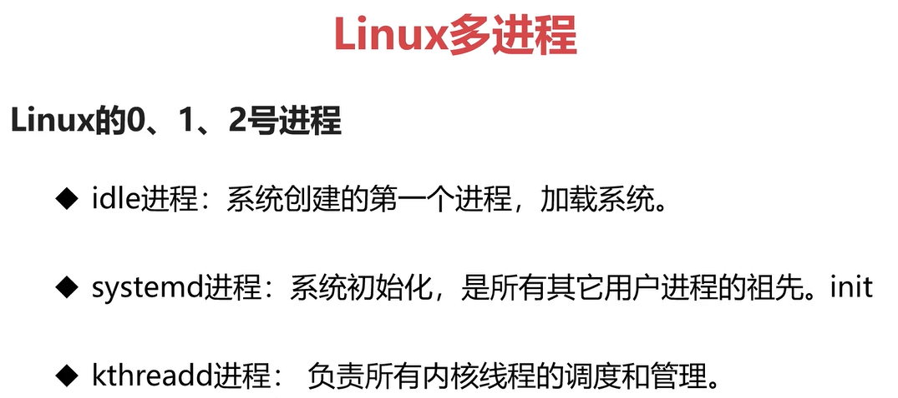

#### fork
- 子进程是父进程的副本
- 子进程获得了父进程的数据空间、堆和栈的副本、不是共享
- 父进程中打开的文件描述副也被复制到子进程中
- 如果父进程先退出，子进程会成为孤儿进程，由1号进程接管
- 如果子进程先退出，内核向父进程发送SIGCHLD信号，如果父进程不处理这个信号 ，子进程会成为僵尸进程
  
#### 僵尸进程的危害:

如果子进程在父进程之前中止，内核为每个子进程保留了一个数据 结构，包括进程 编号，终止状态和使用cpu时间等，父进程如果处理了子进程退出的信息，内核就会释放这个数据结构，如果父进程没有处理子进程退出的信息，内核就不会释放这个数据结构，子进程编号就会一直被占用，但是系统可用的进程号是有限的，如果大量的产生僵尸进程，将因为没有可用的进程号而导致系统不能产生新的进程，这就是僵尸进程的危害

#### 避免僵尸进程:

为了避免成为僵尸，可以让父进程忽略SIGCHLD这个信号，或者用wait捕获到这个信号，但这样会让父进程阻塞，第三种方法是设置SIGCHLD信号处理函数，这样父进程可以避免阻塞       

### 进程的心跳机制

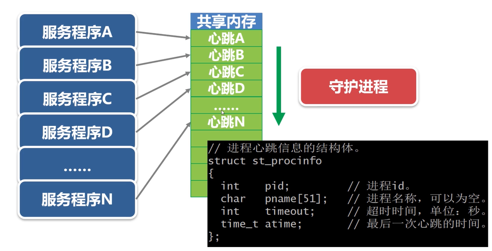

#### 守护进程如何判断服务程序已经死机？
- 心跳机制。
- 创建共享内存，存放服务程序的心跳信息。
- 守护进程，每隔若干秒遍历一次共享内存。终止掉超时进程。

#### 守护进程实现
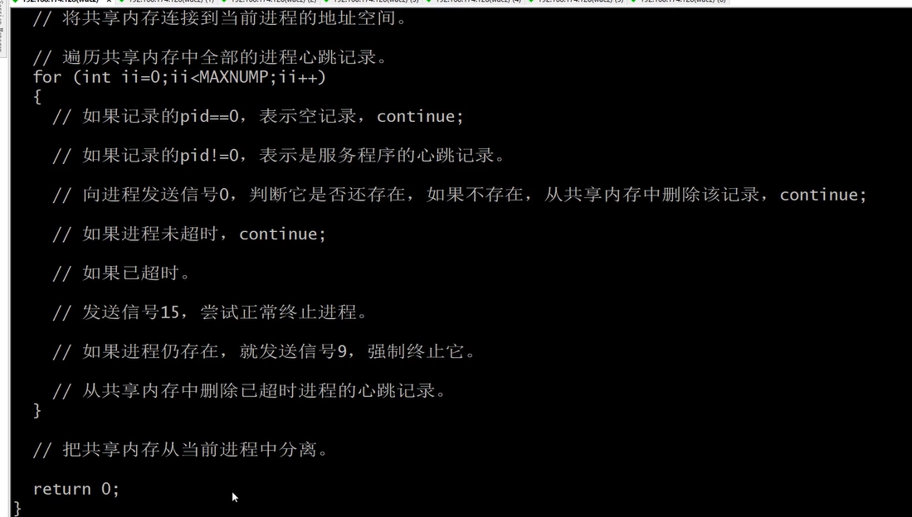

#### 共享内存

共享内存（Shared Memory）就是允许多个进程访问同一个内存空间，是在多个进程之间共享和传递数据最高效的方式。操作系统将不同进程之间共享内存安排为同一段物理内存，进程可以将共享内存连接到它们自己的地址空间中，如果某个进程修改了共享内存中的数据，其它的进程读到的数据也将会改变。  
共享内存并未提供锁机制，也就是说，在某一个进程对共享内存的进行读写的时候，不会阻止其它的进程对它的读写。如果要对共享内存的读/写加锁，可以使用信号量。

## 开发基于tcp协议的文件传输子系统

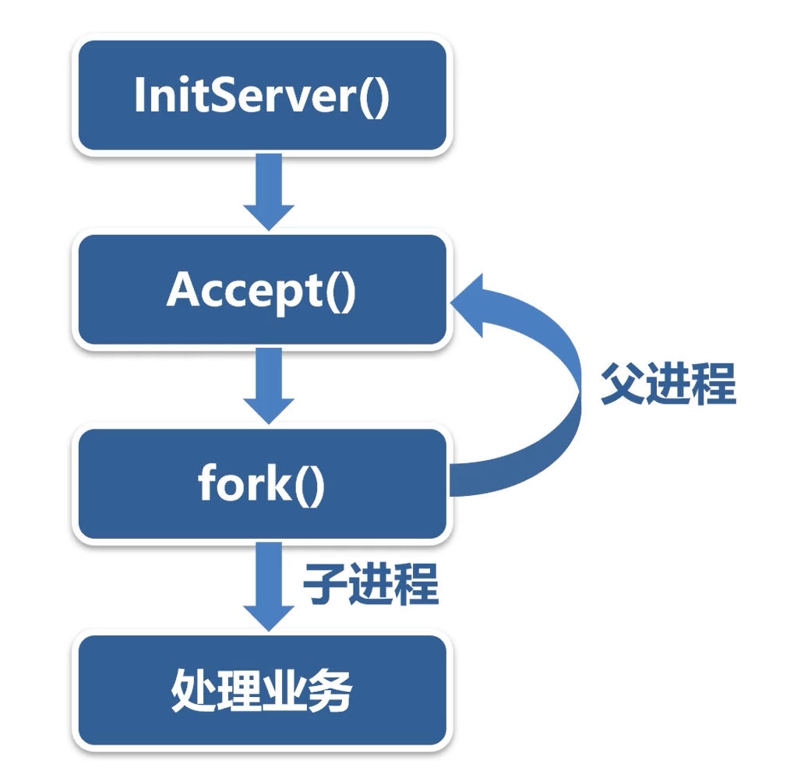

#### 多进程网络服务端程序退出的三种情况：
* 1）如果是子进程收到退出信号，该子进程断开与客户端连接的socket，然后退出。
* 2）如果是父进程收到退出信号，父进程先关闭监听的socket，然后向全部的子进程发出退出信号。
* 3）如果父子进程都收到退出信号，本质上与第2种情况相同。

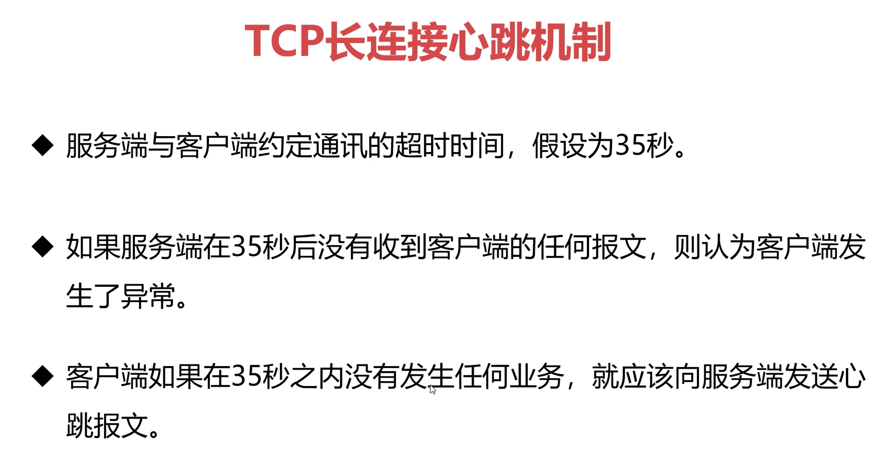

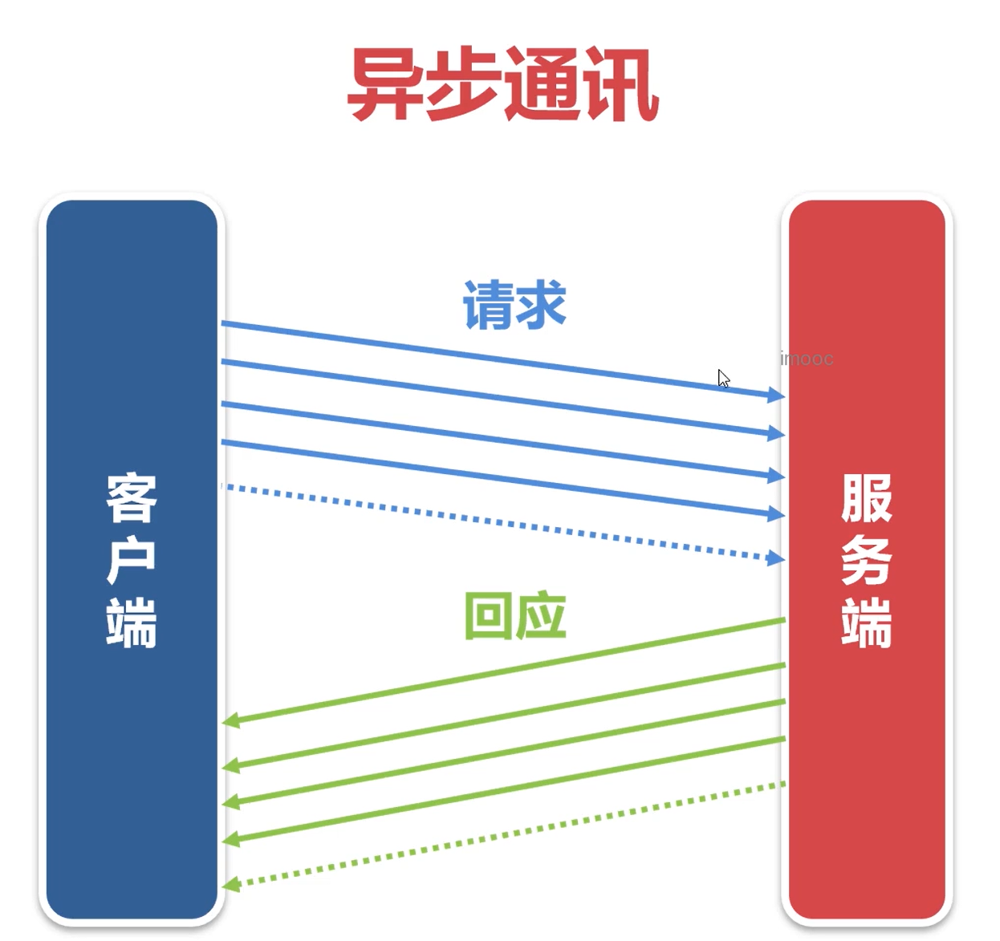

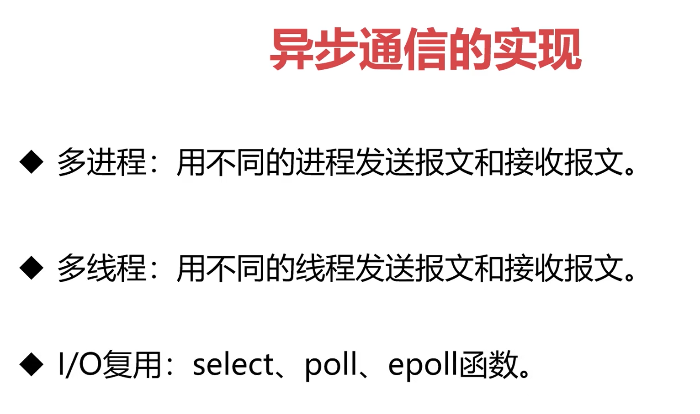

## 开发数据服务总线

#### 数据库连接池
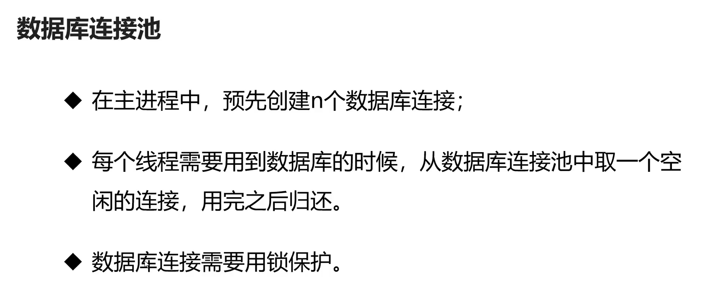

- 预先创建10个 Oracle 数据库连接
- 使用互斥锁
- CPU 2核4G, 性能在200次/秒

数据库连接池的优化

- 设定数据库连接池的最大连接数（仍然为10）
- 连接数不够时，自动扩展，建立新的连接
- 连接空闲时(n秒未使用)，自动断开，释放资源
    - 在服务程序中，用一个专用的子线程调用此函数：检查数据库连接池，断开空闲连接
    - 判断连接是否超时（超时时间本项目中设置为50s）
        - 如果超时，断开数据库连接，重置连接使用时间
        - 如果没有超时，执行一次SQL，验证连接是否有效
#### 线程池实现

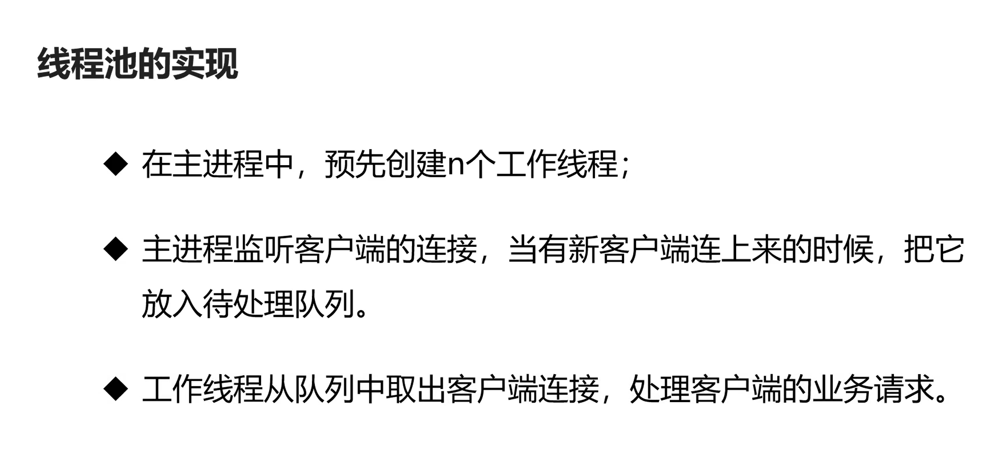

在队列中，存放的是客户端的socket

采用条件变量+互斥锁实现队列功能

- CPU 2核4G, 性能在1000次/秒（使用数据库，数据库连接池+线程池）
- CPU 2核4G, 性能在6000次/秒（不使用数据库）

> 线程数比CPU核数略多会比较好

#### 线程池监控

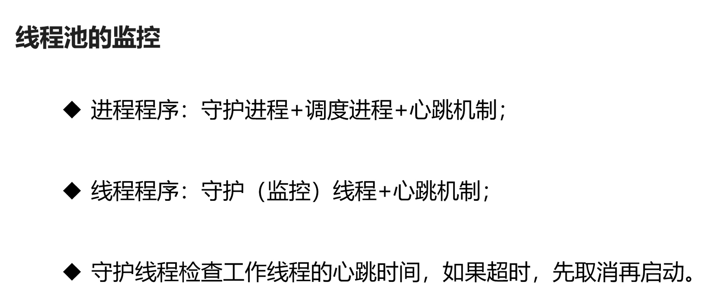
> 线程之间的地址是共享的  

工作线程定时报告自己信息。

## I/O复用技术

#### epoll 水平触发

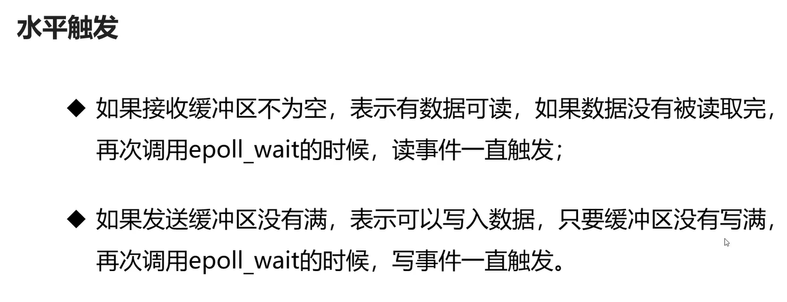

#### epoll 边缘触发

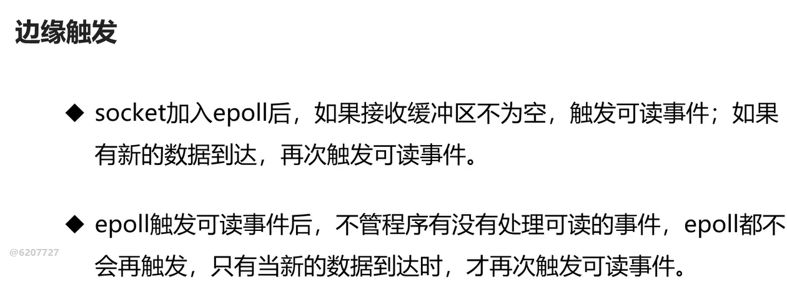
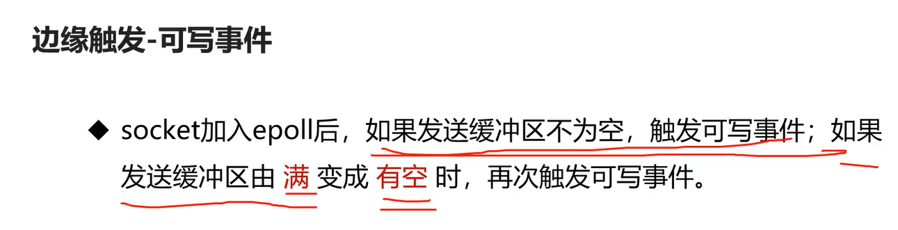

#### 阻塞和非阻塞 IO 定义
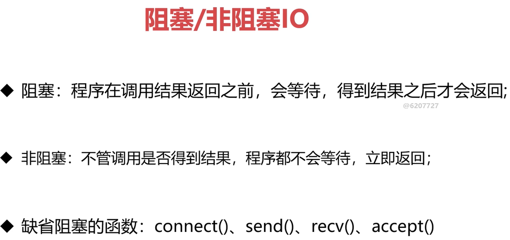

#### I/O 复用需要非阻塞 IO
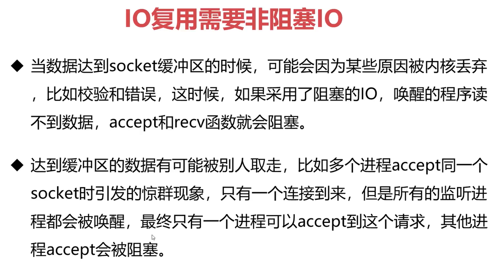

#### 正向代理
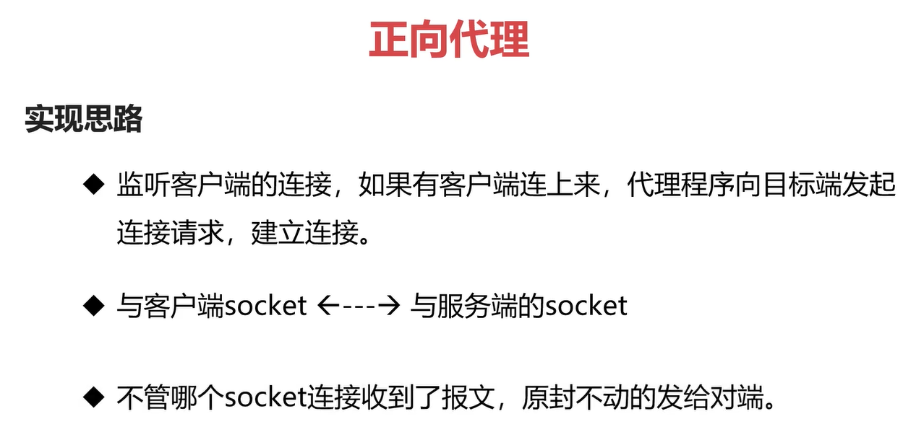

#### 反向代理
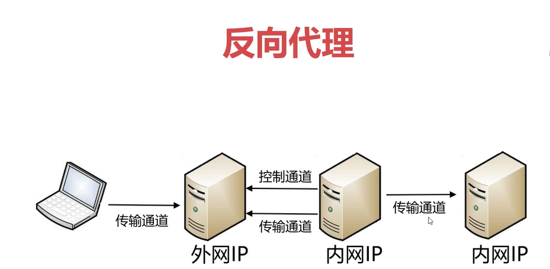